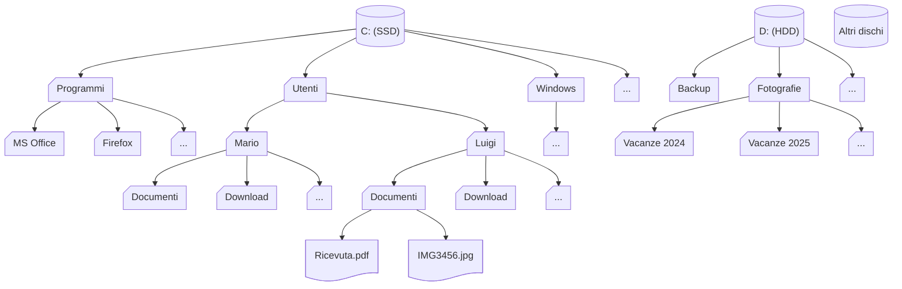

```mermaid
graph TB
    A@{shape: cyl, label: "C: (SSD)" } --> B@{shape: notch-rect, label: "Programmi" }
    B --> O@{shape: notch-rect, label: "MS Office" }
    B --> P@{shape: notch-rect, label: "Firefox" }
    B --> Q@{shape: notch-rect, label: "..." }
    A --> C@{shape: notch-rect, label: "Utenti" }
    C --> M@{shape: notch-rect, label: "Mario" }
    C --> N@{shape: notch-rect, label: "Luigi" }
    A --> D@{shape: notch-rect, label: "Windows" }
    A --> L@{shape: notch-rect, label: "..." }
        D --> L1@{shape: notch-rect, label: "..." }
    M --> M2@{shape: notch-rect, label: "Documenti" }
    M --> M3@{shape: notch-rect, label: "Download" }
    M --> M5@{shape: notch-rect, label: "..." }
    N --> N2@{shape: notch-rect, label: "Documenti" }
    N --> N3@{shape: notch-rect, label: "Download" }
    N --> N5@{shape: notch-rect, label: "..." }
    N2 --> M11@{shape: doc, label: "Ricevuta.pdf" }
    N2 --> M12@{shape: doc, label: "IMG3456.jpg" }

    E@{shape: cyl, label: "D: (HDD)" } --> G@{shape: notch-rect, label: "Backup" }
    E --> F@{shape: notch-rect, label: "Fotografie" }
    
    F --> H@{shape: notch-rect, label: "Vacanze 2024" }
    F --> I@{shape: notch-rect, label: "Vacanze 2025" }
    F --> J@{shape: notch-rect, label: "..." }
    E --> K@{shape: notch-rect, label: "..." }


    Z@{shape: cyl, label: "Altri dischi" }

```